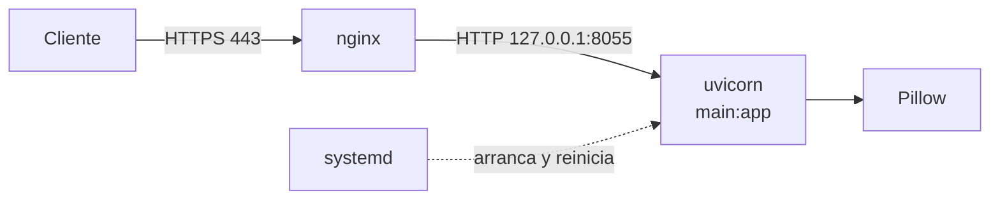

# Guía de instalación en producción — boro

boro se despliega como una app FastAPI servida por uvicorn, gestionada por systemd y publicada detrás de nginx con HTTPS. Esta guía instala el código **tal como está** en `main`, sin modificar `main.py`.

## Contenido

1. [Resumen](#resumen)
2. [Requisitos](#requisitos)
3. [Instalación](#instalación)
4. [Ejecución con systemd](#ejecución-con-systemd)
5. [nginx y HTTPS](#nginx-y-https)
6. [Verificación](#verificación)
7. [Comportamiento del código actual en producción](#comportamiento-del-código-actual-en-producción)
8. [Actualización, logs y problemas](#actualización-logs-y-problemas)

## Resumen

El servicio expone tres rutas:

| Método | Ruta | Qué hace |
| --- | --- | --- |
| GET | `/` | Devuelve `{"Hello": "World"}` |
| POST | `/comprimir` | Recibe `file` (jpg, jpeg, png, webp; máx. 50 MB) y `quality` (form, por defecto 50); devuelve la imagen recomprimida |
| GET | `/docs` | Swagger UI generado por FastAPI |



nginx termina TLS y limita el tamaño de subida; uvicorn solo escucha en local.

## Requisitos

Un servidor Linux con Python 3.12 basta; Pillow trae sus librerías de imagen en el wheel y no necesita paquetes de sistema en x86_64 ni arm64.

| Elemento | Valor |
| --- | --- |
| Sistema | Ubuntu 24.04 o Debian 12 (cualquier Linux con systemd sirve) |
| Python | 3.12 |
| Paquetes | `python3.12-venv`, `git`, `nginx`, `certbot`, `python3-certbot-nginx` |
| Memoria | 1 GB mínimo; cada petición carga la imagen completa en RAM (hasta 50 MB comprimidos, mucho más descomprimida) |
| Puertos | 80 y 443 abiertos; 8055 solo en `127.0.0.1` |
| Dominio | Un registro DNS apuntando al servidor, necesario para HTTPS |

```bash
sudo apt update
sudo apt install -y python3.12-venv git nginx certbot python3-certbot-nginx
```

## Instalación

El código vive en `/opt/boro`, con un usuario de sistema propio `boro` y su entorno virtual en `/opt/boro/.venv`.

1. Crear el usuario sin shell ni login:
    ```bash
    sudo useradd --system --home /opt/boro --shell /usr/sbin/nologin boro
    ```
2. Clonar el repositorio:
    ```bash
    sudo git clone https://github.com/wariox3/boro.git /opt/boro
    sudo chown -R boro:boro /opt/boro
    ```
3. Crear el entorno virtual e instalar dependencias:
    ```bash
    sudo -u boro python3.12 -m venv /opt/boro/.venv
    sudo -u boro /opt/boro/.venv/bin/pip install --upgrade pip
    sudo -u boro /opt/boro/.venv/bin/pip install -r /opt/boro/requirements.txt
    ```
4. Prueba rápida en local (Ctrl+C para salir):
    ```bash
    cd /opt/boro
    sudo -u boro .venv/bin/uvicorn main:app --host 127.0.0.1 --port 8055
    # en otra terminal:
    curl http://127.0.0.1:8055/
    ```
    Debe responder `{"Hello":"World"}`.

`requirements.txt` ya incluye `uvicorn`, `uvloop`, `httptools` y `python-multipart` (necesario para recibir el formulario de `/comprimir`); no hay que instalar nada más. El proyecto no usa variables de entorno.

## Ejecución con systemd

uvicorn corre con 2 workers como servicio `boro.service`, escuchando solo en `127.0.0.1:8055` y reiniciándose si cae. Usar varios workers importa: la compresión bloquea el proceso mientras dura, así que con un solo worker las peticiones se atienden de una en una.

Crear `/etc/systemd/system/boro.service`:

```ini
[Unit]
Description=boro - servicio de compresion de imagenes
After=network.target

[Service]
User=boro
Group=boro
WorkingDirectory=/opt/boro
ExecStart=/opt/boro/.venv/bin/uvicorn main:app \
    --host 127.0.0.1 --port 8055 \
    --workers 2 \
    --proxy-headers --forwarded-allow-ips 127.0.0.1
Restart=always
RestartSec=3
NoNewPrivileges=true
PrivateTmp=true
ProtectSystem=full

[Install]
WantedBy=multi-user.target
```

Activarlo:

```bash
sudo systemctl daemon-reload
sudo systemctl enable --now boro
sudo systemctl status boro
```

Regla para `--workers`: uno por núcleo de CPU, vigilando la RAM (cada worker puede tener varias imágenes grandes en memoria a la vez).

## nginx y HTTPS

nginx es quien de verdad limita el tamaño de subida: `max_upload_size` en `main.py` no es una opción de FastAPI y no tiene efecto, y la app solo rechaza archivos de más de 50 MB después de haberlos leído enteros. Se fija `client_max_body_size 51M` (50 MB más el margen del formulario multipart).

Crear `/etc/nginx/sites-available/boro` (sustituir `boro.ejemplo.com`):

```nginx
server {
    listen 80;
    server_name boro.ejemplo.com;

    client_max_body_size 51M;
    client_body_timeout 60s;

    location / {
        proxy_pass http://127.0.0.1:8055;
        proxy_http_version 1.1;
        proxy_set_header Host $host;
        proxy_set_header X-Real-IP $remote_addr;
        proxy_set_header X-Forwarded-For $proxy_add_x_forwarded_for;
        proxy_set_header X-Forwarded-Proto $scheme;
        proxy_read_timeout 120s;
        proxy_request_buffering on;
    }
}
```

Activar el sitio y obtener el certificado:

```bash
sudo ln -s /etc/nginx/sites-available/boro /etc/nginx/sites-enabled/
sudo nginx -t && sudo systemctl reload nginx
sudo certbot --nginx -d boro.ejemplo.com
```

certbot añade el bloque `listen 443`, la redirección de HTTP a HTTPS y la renovación automática. Con `proxy_request_buffering on`, nginx recibe el archivo completo antes de pasarlo a uvicorn, y así un cliente lento no mantiene ocupado un worker.

Si el servidor tiene firewall `ufw`:

```bash
sudo ufw allow 'Nginx Full'
```

## Verificación

El despliegue está bien si las pruebas responden como en la tabla, primero en local y luego por el dominio.

```bash
# 1. Raíz
curl https://boro.ejemplo.com/

# 2. Compresión (con una foto.jpg local)
curl -X POST https://boro.ejemplo.com/comprimir \
    -F "file=@foto.jpg" -F "quality=60" \
    -o foto_comprimida.jpg -w "%{http_code} %{size_download} bytes\n"

# 3. Documentación
curl -s -o /dev/null -w "%{http_code}\n" https://boro.ejemplo.com/docs
```

| Prueba | Resultado esperado |
| --- | --- |
| `GET /` | `{"Hello":"World"}` |
| `POST /comprimir` con JPG válido | `200` y archivo `foto_comprimida.jpg` |
| `POST /comprimir` con `.gif` | `500` con `Formato no soportado` (el código actual convierte el 400 en 500) |
| `POST /comprimir` con archivo de 60 MB | `413` devuelto por nginx |
| `GET /docs` | `200` |

## Comportamiento del código actual en producción

El código se despliega sin cambios, así que estos comportamientos llegan a producción; la columna de mitigación solo usa infraestructura.

| Comportamiento | Efecto en producción | Mitigación sin tocar código |
| --- | --- | --- |
| Todo error sale como `500` | Monitores y clientes no distinguen fallos del cliente de fallos del servidor | Alertar por tasa de 500, no por cada uno |
| La compresión bloquea el worker | Peticiones en cola bajo carga | `--workers` según CPU; `proxy_read_timeout 120s` |
| El archivo se lee entero en RAM | Picos de memoria con subidas grandes | `client_max_body_size 51M`; `MemoryMax=1G` en systemd |
| Sin límite de píxeles propio | Una imagen pequeña con muchos píxeles puede agotar la RAM | Límite de memoria del servicio (`MemoryMax=1G` en systemd) |
| Los errores devuelven el detalle interno | Se exponen mensajes de Python al cliente | Aceptarlo o filtrar en nginx |
| `/docs` es público | Cualquiera ve y prueba la API | Restringir con `location /docs` y `allow`/`deny` en nginx si hace falta |
| Sin autenticación ni límite de peticiones | Uso abusivo del CPU | `limit_req` en nginx |
| `quality` sin rango y `optimize=false` falla | Peticiones mal formadas dan 500 | Documentar a los clientes que no envíen `optimize` |

Limitar peticiones en nginx (dentro de `http {}` y del `location /`):

```nginx
# /etc/nginx/nginx.conf, bloque http
limit_req_zone $binary_remote_addr zone=boro:10m rate=5r/s;

# /etc/nginx/sites-available/boro, dentro de location /
limit_req zone=boro burst=10 nodelay;
```

## Actualización, logs y problemas

Para actualizar con un solo comando, usar `/root/actualizar_boro.sh`, descrito en [ACTUALIZACION.md](ACTUALIZACION.md). A mano: bajar los cambios, reinstalar dependencias y reiniciar el servicio.

```bash
cd /opt/boro
sudo -u boro git pull
sudo -u boro .venv/bin/pip install -r requirements.txt
sudo systemctl restart boro
```

Para volver atrás: `sudo -u boro git checkout <commit_anterior>` y reiniciar.

Logs:

```bash
sudo journalctl -u boro -f             # app (uvicorn)
sudo tail -f /var/log/nginx/access.log # peticiones
sudo tail -f /var/log/nginx/error.log  # errores de proxy
```

| Síntoma | Causa probable | Solución |
| --- | --- | --- |
| `502 Bad Gateway` | uvicorn parado | `systemctl status boro` y revisar `journalctl -u boro` |
| `413 Request Entity Too Large` | Archivo mayor que `client_max_body_size` | Esperado por encima de 50 MB |
| `504 Gateway Timeout` | Imagen muy pesada o workers ocupados | Subir `proxy_read_timeout` o `--workers` |
| `500` con `Form data requires "python-multipart"` | Dependencia no instalada | Reinstalar `requirements.txt` en el venv |
| El servicio se reinicia en bucle | Error al importar `main.py` o puerto 8055 ocupado | `journalctl -u boro -n 50`; `ss -ltnp \| grep 8055` |
| `git pull` falla por `__pycache__` | El `.pyc` estaba versionado en commits antiguos | `sudo -u boro git checkout -- __pycache__` y repetir |
